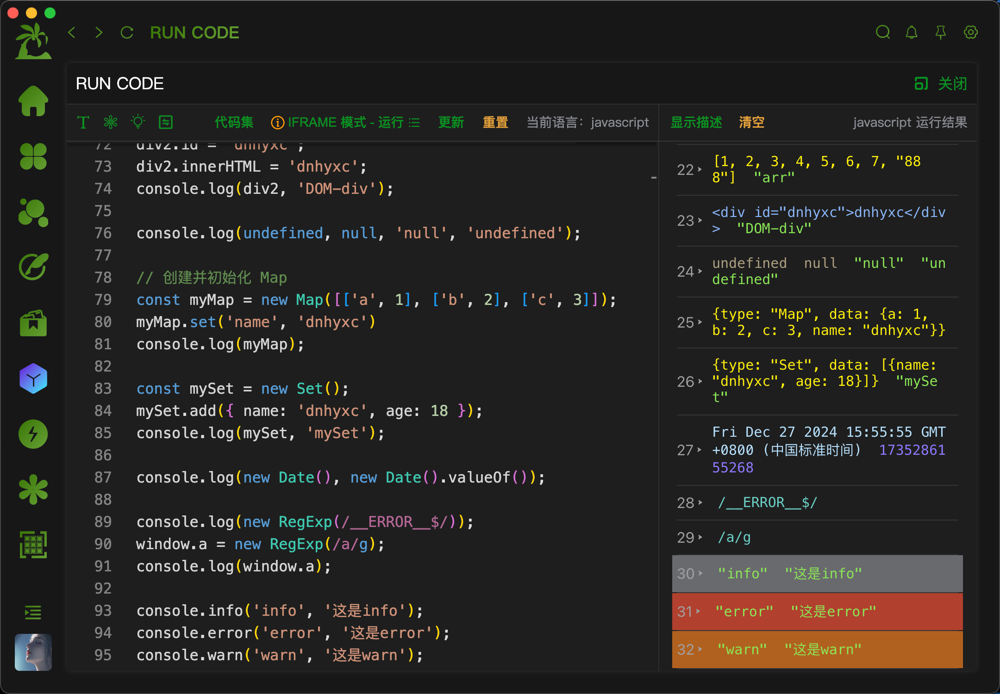
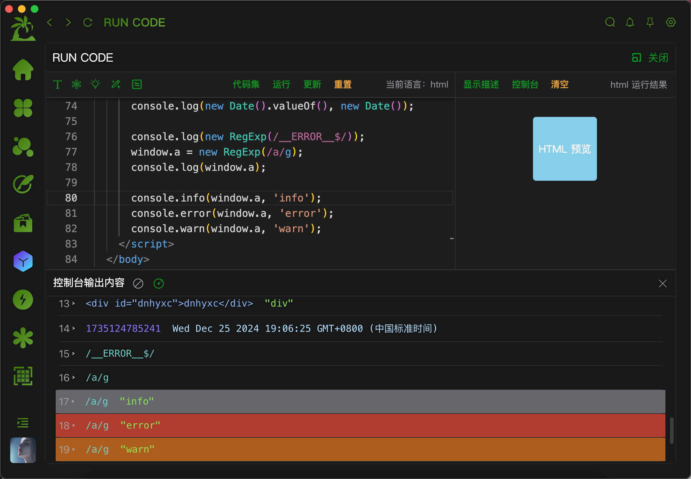

## 如何实现一个多种语言的代码执行输出工具

## 背景

有时候我们通常需要写一些 demo 或者代码片段进行测试，但是又并不想打开 vscode 或者其他 IDE，这时候我们就需要一个工具来帮助我们快速执行代码并查看输出结果。

通常我们可以用一些在线代码编辑器，比如 codesandbox、codepen 等，但是这些在线编辑器往往打开比较慢，有些不使用科学上网甚至都无法成功加载。

因此，为了方便快速执行代码并查看输出结果，就想着自己实现一个代码执行输出工具。

## 实现 JS 执行并获取执行结果

### 执行 JS 代码的方式

要实现 JS 代码的执行，通常我们会想到通过 `eval()` 函数或者 `new Function()` 构造函数来执行代码。

除了使用 `eval()` 和 `new Function()` 之外，还可以将需要运行的 js 代码放到一个 iframe 中的 `<script>` 标签中来让它执行。这同样需要面临一个问题，那就是如何获取 iframe 中的执行结果。

甚至我们还能通过 `vm` 库来实现代码的执行，不过这需要借助于 Node.js 环境。同时，vm 库也有一些限制，比如不能执行一些浏览器 API，如：`window`、`document`、`XMLHttpRequest` 等。

以上方法都面临了一个问题，那就是如何获取到执行结果，并且将结果展示在我们的页面上，而不是在浏览器控制台中展示。

### 方案的选择

为了更加全面的获取到代码执行的结果，最终选择了 iframe 方案来实现。iframe 方案的优点是可以与页面的样式和结构分离，不会影响页面的渲染，可以更好的实现代码的隔离。

使用 iframe 的方案，就需要通过 `postMessage()` 方法来向父页面发送执行结果，父页面通过监听 `message` 事件来获取执行结果。

```js
// ...

function displayMessage(message, className) {
	// 通过 postMessage() 方法将执行结果发送给父页面
	window.parent.postMessage(
		{
			from: "codeRunner",
			type: "log",
			data: message,
		},
		"*"
	);
}
```

### 如何获取到打印输出的结果

对于 iframe 的方案，要获取到打印输出的结果，我们可以改写原有的 `console`，获取到执行输出的结果进行显示。

```js
const customConsole = {
	log: function (message) {
		displayMessage(message, "console-log");
	},
	warn: function (message) {
		displayMessage(message, "console-warn");
	},
	error: function (message) {
		displayMessage(message, "console-error");
	},
	info: function (message) {
		displayMessage(message, "console-log");
	},
	debug: function (message) {
		displayMessage(message, "console-log");
	},
};

function displayMessage(message, className) {
	// 这里就能对 message 输出结果进行处理了，比如显示到页面上
}

customConsole.log("This is a log message.");
customConsole.warn("This is a warning message.");
customConsole.error("This is an error message.");
customConsole.info("This is an info message.");
customConsole.debug("This is a debug message.");
```

### 一个简单的 demo

这个 demo 可以实现简单的打印输出功能，但是无法处理复杂的打印输出场景，比如：对象、数组、函数等，都无法正确的获取到输出结果，有兴趣的可以自己尝试一下。

```html
<!DOCTYPE html>
<html lang="en">
	<head>
		<meta charset="UTF-8" />
		<meta name="viewport" content="width=device-width, initial-scale=1.0" />
		<title>Console Tool</title>
		<style>
			body {
				font-family: Arial, sans-serif;
				padding: 20px;
			}
			.console-container {
				border: 1px solid #ccc;
				padding: 10px;
				width: 80%;
				margin: 20px auto;
				max-height: 400px;
				overflow-y: auto;
				background-color: #f9f9f9;
			}
			.console-log,
			.console-warn,
			.console-error {
				padding: 5px;
				margin: 5px 0;
				border-radius: 5px;
			}
			.console-log {
				background-color: #e0e0e0;
			}
			.console-warn {
				background-color: #fff3cd;
			}
			.console-error {
				background-color: #f8d7da;
			}
			button {
				margin: 10px;
				padding: 8px 16px;
				background-color: #007bff;
				color: white;
				border: none;
				border-radius: 5px;
				cursor: pointer;
			}
			button:hover {
				background-color: #0056b3;
			}
		</style>
	</head>
	<body>
		<button onclick="clearConsole()">Clear Console</button>
		<div class="console-container" id="consoleContainer"></div>

		<script>
			const customConsole = {
				log: function (message) {
					displayMessage(message, "console-log");
				},
				warn: function (message) {
					displayMessage(message, "console-warn");
				},
				error: function (message) {
					displayMessage(message, "console-error");
				},
				info: function (message) {
					displayMessage(message, "console-log");
				},
				debug: function (message) {
					displayMessage(message, "console-log");
				},
			};

			function displayMessage(message, className) {
				const consoleContainer = document.getElementById("consoleContainer");
				const logElement = document.createElement("div");
				logElement.classList.add(className);
				logElement.textContent = message;
				consoleContainer.appendChild(logElement);
				consoleContainer.scrollTop = consoleContainer.scrollHeight;
			}

			function clearConsole() {
				const consoleContainer = document.getElementById("consoleContainer");
				consoleContainer.innerHTML = "";
			}

			customConsole.log("This is a log message.");
			customConsole.warn("This is a warning message.");
			customConsole.error("This is an error message.");
			customConsole.info("This is an info message.");
			customConsole.debug("This is a debug message.");
		</script>
	</body>
</html>
```

### 如何兼容 Object、Array、Function 等其他数据格式的打印输出

对于这些复杂的数据类型，我们可以通过 `JSON.stringify()` 方法将其转换为 JSON 字符串。但是对于 `window`、`document` 等存在循环引用的对象，是无法使用 `JSON.stringify()` 进行序列化的。

因此对于存在循环引用的对象，就需要对其进行深度的限制以及大小的限制，否则可能会导致堆栈溢出，从而导致执行崩溃。

深度的限制，我们可以定义一个 `WeakSet` 对象，用于存储已经序列化过的对象，如果遇到循环引用的对象，就直接返回 `[Circular]` 字符串。具体代码会在下文中提供。

对于 Function 函数，我们可以直接将其转换为字符串。父页面拿到输出的字符串函数之后，我们可以通过 `new Function()` 对其进行再次加工处理。

对于 DOM 对象，我们可以直接获取其 outerHTML 字符串，并在输出时添加 `__DOM__` 后缀，方便在页面上进行区分是否是 DOM 对象。

对于 Map、Set 等集合类型，我们可以通过定义一个普通的对象，然后通过遍历的方式，将 Map 或者 Set 对象的值转换为普通对象，再进行序列化。

其他的数据类型，将会在下发代码中进行展示，这里就不再一一赘述了。

### 兼容处理的具体代码

为了兼容大部分的打印输出场景，对打印输出的 Object 对象、Array 数组、Function 函数、Date、RegExp、Error、Map、Set 等数据类型进行了如下的处理：

```js
const scriptCode = () => {
	// 定义一个WeakSet，用于存储已经序列化过的对象，防止循环引用
	let seen = new WeakSet();

	// 添加深度限制和大小限制的序列化函数
	function safeStringify(obj, depth = 5, maxSize = 1024 * 10) {
		const stack = [];

		function serialize(value, currentDepth = 0) {
			// 检查深度限制
			if (currentDepth > depth) return "[Max Depth Reached]";

			// 检查对象大小限制
			if (stack.length > maxSize) return "[Max Size Reached]";

			// 处理基本类型
			if (["string", "number", "boolean"].includes(typeof value)) return value;

			// 处理函数
			if (typeof value === "function") return String(value);

			// 处理undefined，之所以要添加__UNDEFINED__后缀，是为了在后续显示时，可以判断出是undefined值
			if (typeof value === "undefined") return "undefined__UNDEFINED__";

			// 处理null
			if (value === null) return value;

			if (typeof value === "object") {
				// 处理循环引用
				if (seen.has(value)) return "[Circular]";
				seen.add(value);

				// 处理window.Error
				if (value === Error) return String(value);

				// 处理自定义new Error()，之所以要添加 __ERROR__ 后缀，是为了在后续显示时，可以判断出是Error对象
				if (value instanceof Error) return String(value) + "__ERROR__";

				// 处理localStorage
				if (value instanceof Storage) return {};

				// 处理DOM元素，之所以要添加 __DOM__ 后缀，是为了在后续显示时，可以判断出是DOM元素
				if (value instanceof HTMLElement) return value.outerHTML + "__DOM__";

				// 处理Map
				if (value instanceof Map) {
					const mapObj = {};
					value.forEach((v, k) => {
						mapObj[k] = serialize(v, currentDepth + 1);
					});
					return { type: "Map", data: mapObj };
				}

				// 处理Set
				if (value instanceof Set) {
					const setArray = [];
					value.forEach((v) => {
						setArray.push(serialize(v, currentDepth + 1));
					});
					return { type: "Set", data: setArray };
				}

				// 处理WeakMap，因为weakMap无法进行循环遍历，所以直接返回[WeakMap]字符串
				if (value instanceof WeakMap) {
					return "[WeakMap]";
				}

				// 处理正则， 加上__REGEXP__后缀，是为了在后续显示时，可以判断出是RegExp对象
				if (value instanceof RegExp) {
					return value.toString() + "__REGEXP__";
				}

				// 处理日期
				if (value instanceof Date) {
					return value.toString();
				}

				// 处理数组和对象
				const isArray = Array.isArray(value);

				const result = isArray ? [] : {};

				for (const key in value) {
					if (Object.prototype.hasOwnProperty.call(value, key)) {
						result[key] = serialize(value[key], currentDepth + 1);
					}
				}

				return result;
			}

			// 默认返回字符串
			return String(value);
		}

		try {
			// 将对象序列化为JSON字符串
			return JSON.stringify(serialize(obj), null, 2);
		} catch (e) {
			return "[Serialization Error]";
		}
	}
};
```

上述方法兼容处理了大部分的输出场景，如果遇到特殊的场景，可以自己添加相应的处理逻辑。

### 收集代码执行报错信息

为了收集代码执行的报错信息，我们需要通过 `try...catch` 捕获代码执行阶段的报错，并发送给父页面，即：

```js
export const codeTemplate = (value: string) => {
	const template = `
    <body>
      <script>
        ${scriptCode}

        try {
          value
        } catch(e) {
          window.parent.postMessage({ from: 'codeRunner', type: 'error', data: e }, '*')
        }
      </script>
    </body>
  `;
	return template;
};
```

通过上述方式，可以成功的捕获代码执行阶段的报错信息，但是对于一些语法错误，比如：重复定义变量、语法错误等，无法捕获到报错信息，只能在控制台中看到。那么要怎么才能捕获到这些报错信息呢？

答案是：通过 `eval()` 函数来执行代码，如果执行失败，就会抛出异常，这样我们可以捕获到异常信息，并发送给父页面。具体代码如下：

```js
export const codeTemplate = (value: string) => {
	const template = `
    <body>
      <script>
        ${scriptCode}

        try {
          // 这里使用eval是为了提前捕获在代码解析阶段抛出的错误，比如：重复定义变量
          eval(\`${value}\`);
        } catch(e) {
          window.parent.postMessage({ from: 'codeRunner', type: 'error', data: e }, '*')
        }
      </script>
    </body>
  `;
	return template;
};
```

### 最终实现

最终的实现代码如下：

- html:

```html
<!DOCTYPE html>
<html lang="en">
	<head>
		<meta charset="UTF-8" />
		<meta name="viewport" content="width=device-width, initial-scale=1.0" />
		<title>Developer Tools</title>
		<style>
			.cotntet {
				display: flex;
				justify-content: space-between;
			}

			.left,
			.right {
				flex: 1;
			}

			.title {
				margin-bottom: 20px;
			}

			#inputRef,
			#outputRef {
				width: 100%;
			}

			.right {
				margin-left: 50px;
			}
		</style>
		<script src="index.js" type="module"></script>
	</head>
	<body>
		<h1>Developer Tools</h1>
		<div class="cotntet">
			<div class="left">
				<div>
					<div class="title">
						<button id="initBtn">生成HTML</button>
						<button id="runBtn">运行</button>
					</div>
					<textarea
						id="inputRef"
						rows="20"
						style="resize: none"
						placeholder="输入代码"
					></textarea>
				</div>
				<div id="iframeRef"></div>
			</div>
			<div class="right">
				<div class="title">运行结果</div>
				<textarea
					id="outputRef"
					readonly
					rows="20"
					style="resize: none"
				></textarea>
			</div>
		</div>
	</body>
</html>
```

- index.js:

```js
let iframeNode = null;
let codeResults = "";
const inputRef = document.getElementById("inputRef");
const runBtn = document.getElementById("runBtn");
const initBtn = document.getElementById("initBtn");
const iframeRef = document.getElementById("iframeRef");
const outputRef = document.getElementById("outputRef");

const scriptCode = `
  const consoleMethods = ['log', 'info', 'debug', 'warn', 'error', 'table', 'time', 'timeEnd'];
  
  let seen = new WeakSet();

  // 添加深度限制和大小限制的序列化函数
  function safeStringify(obj, depth = 5, maxSize = 1024 * 10) {
    const stack = [];

    function serialize(value, currentDepth = 0) {
      // 检查深度限制
      if (currentDepth > depth) return '[Max Depth Reached]';

      // 检查对象大小限制
      if (stack.length > maxSize) return '[Max Size Reached]';

      // 处理基本类型
      if (['string', 'number', 'boolean'].includes(typeof value)) return value;

      // 处理函数
      if (typeof value === 'function') return String(value);

      // 处理undefined
      if (typeof value === 'undefined') return 'undefined';

      // 处理null
      if (value === null) return value;

      // 处理循环引用
      if (typeof value === 'object') {
        if (seen.has(value)) return '[Circular]';

        seen.add(value);

        // 处理window.Error
        if (value === Error) return String(value);

        // 处理自定义new Error()
        if (value instanceof Error) return String(value);

        // 处理localStorage
        if (value instanceof Storage) return {}

        // 处理DOM元素
        if (value instanceof HTMLElement) return value.outerHTML;

        // 处理Map
        if (value instanceof Map) {
          const mapObj = {};
          value.forEach((v, k) => {
            mapObj[k] = serialize(v, currentDepth + 1);
          });
          return { type: 'Map', data: mapObj };
        }

        // 处理Set
        if (value instanceof Set) {
          const setArray = [];
          value.forEach(v => {
            setArray.push(serialize(v, currentDepth + 1));
          });
          return { type: 'Set', data: setArray };
        }

        // 处理WeakMap
        if (value instanceof WeakMap) {
          return '[WeakMap]';
        }
          
        // 处理正则
        if (value instanceof RegExp) {
          return value.toString();
        }

        // 处理日期
        if (value instanceof Date) {
          return value.toString();
        }

        // 处理数组和对象
        const isArray = Array.isArray(value);

        const result = isArray ? [] : {};

        for (const key in value) {
          if (Object.prototype.hasOwnProperty.call(value, key)) {
            result[key] = serialize(value[key], currentDepth + 1);
          }
        }

        return result;
      }

      return String(value);
    }

    try {
      return JSON.stringify(serialize(obj), null, 2);
    } catch (e) {
      return '[Serialization Error]';
    }
  }

  consoleMethods.forEach(method => {
    const origin = console[method];
    console[method] = (...args) => {
      try {
        window.parent.postMessage({ 
          from: 'codeRunner', 
          type: method, 
          data: safeStringify(args)
        }, '*');
      } catch (e) {
        // 如果序列化失败，发送错误信息
        window.parent.postMessage({ 
          from: 'codeRunner', 
          type: 'error', 
          data: 'Serialization failed: ' + e.message 
        }, '*');
      }
      // 调用原始方法
      origin.apply(console, args);
      // 执行完成后，重置seen，防止无法多次正确的打印同一个数据
      seen = new WeakSet();
    };

    // 确保方法正确绑定
    console[method] = console[method].bind(console);
  });
`;

const codeTemplate = (value) => {
	const template = `
    <body>
      <script>
        ${scriptCode}

        try {
          // 这里使用eval是为了提前捕获在代码解析阶段抛出的错误，比如：重复定义变量
          eval(\`${value}\`);
        } catch(e) {
          window.parent.postMessage({ from: 'codeRunner', type: 'error', data: e }, '*')
        }
      </script>
    </body>
  `;
	return template;
};

runBtn.addEventListener("click", () => {
	createIframe({ code: codeTemplate(inputRef.value), display: "none" });
});

initBtn.addEventListener("click", () => {
	inputRef.value = `
    let obj1 = { name: 'obj1' };
    let obj2 = { a: obj1 };
    obj1.obj1 = window.location.reload;
    obj2.obj2 = obj2;
    console.log(obj1);
    console.log(obj2.obj2, 'obj2');

    console.log(Error, 'null', new Error());

    console.log(undefined, null, 'null', 'undefined');

    console.log(window.location.reload);

    const fun = () => {
      console.log(111);
    };
    function fun1() {
      return 111;
    }
    const fun2 = function () {
      return 'fun2';
    };
    console.log(fun);
    console.log(fun());
    console.log(fun1);
    console.log(fun2);

    const data = {
      title: 'coderun 实现逻辑',
      content: '首先你要这样，再这样，最后再这样，就好了',
      author: 'dnhyxc',
      like: 999,
    };
    console.log(data, 11, '这是一个对象');

    const arr = [1, 2, 3, 4, 5, 6, 7, '888'];
    console.log(arr, 'arr');

    const div = document.createElement('div');
    div.id = 'dnhyxc';
    div.innerHTML = 'dnhyxc';
    console.log(div, 'div');

    console.log(new Date().valueOf(), new Date());
    
    console.log(new RegExp(/__ERROR__$/));
    window.a = new RegExp(/a/g);
    console.log(window.a);
  `;
});

const createIframe = ({ code, display }) => {
	iframeNode && iframeRef.removeChild(iframeNode);
	const iframe = document.createElement("iframe");
	iframeNode = iframe;
	iframe.src = "about:blank";
	iframe.style.display = display;
	iframeRef.appendChild(iframe);
	const frameDocument = iframe.contentWindow.document;
	frameDocument.open();
	frameDocument.write(code);
	frameDocument.close();
};

// 格式化解析数据
const JSONParse = (objStr) => {
	return JSON.parse(objStr, (k, v) => {
		if (
			typeof v === "string" &&
			v.indexOf &&
			(v.indexOf("function") > -1 || v.indexOf("=>") > -1)
		) {
			try {
				if (v.startsWith("function") || v.includes("=>")) {
					return new Function(`return ${v}`)();
				}
			} catch (error) {
				return v;
			}
		}
		return v;
	});
};

// 监听 iframe 中运行 code 后发送的消息
window.addEventListener("message", (e) => {
	if (e.data.from === "codeRunner") {
		const { data, type } = e.data;
		if (type === "error") {
			// 处理运行时错误信息
			outputRef.innerHTML = data;
		} else {
			const parseData = JSONParse(data);
			// 运行结果信息
			let code = parseData
				.map((item) => (typeof item === "object" ? JSON.stringify(item) : item))
				.join("\n")
				.replace(/"([^"]+)":/g, "$1: ");
			codeResults += `${code}\n\n`;
			outputRef.innerHTML = codeResults;
		}
	}
});
```

### 在项目中最终呈现的效果

在最终的项目呈现上，你可以自定义处理运行结果的展示方式，比如呈现这种效果：



显示效果的呈现，你可以根据自己的喜好进行调整。比如判断输出的数据类型，然后进行不同的展示方式。其中有些无法区分的，可以在上述 `scriptCode` 中添加相应的标识，比如标识是否 DOM 元素：

```js
const scriptCode = `
	... // 省略其他代码

  function safeStringify(obj, depth = 5, maxSize = 1024 * 10) {
    function serialize(value, currentDepth = 0) {
			... // 省略其他代码

      // 处理DOM元素
      if (value instanceof HTMLElement) return value.outerHTML + '__DOM__';

			... // 省略其他类型判断
		}
  }

	... // 省略其他代码
`;
```

## 实现 HTML 的执行并查看效果

有时候，我们还可能需要测试一些 HTML 代码的执行后的样式效果，为了达到这种目的，也可以在页面上嵌入一个 iframe，并将 HTML 代码写入到这个 iframe 中，然后执行这个 iframe 中的代码，并将执行结果展示在页面上。

### 具体的实现方式

通上述执行 JS 代码的实现方式差不多，即：首先需要创建一个 `iframe`，然后将 html 代码写入到这个 iframe 中的 `body` 里面，这样就天然达到了执行 html 的效果。

创建 `iframe` 并写入 html 代码，具体实现与上述 JS 代码执行的实现方式一致：

```js
const createIframe = ({ code, display, id }) => {
	iframeNode && iframeRef.removeChild(iframeNode);
	const iframe = document.createElement("iframe");
	iframeNode = iframe;
	iframe.src = "about:blank";
	iframe.style.display = display;
	id && (iframe.id = id);
	iframeRef.appendChild(iframe);
	const frameDocument = iframe.contentWindow.document;
	frameDocument.open();
	if (id) {
		if (timer) {
			clearTimeout(timer);
			timer = null;
		}
		timer = setTimeout(() => {
			frameDocument.write(code);
		}, 10);
	} else {
		frameDocument.write(code);
	}
	frameDocument.close();
};
```

之后，我们还要对需要执行的 html 代码进行一些处理，即完善一些默认的 html 标签代码，因为用户在输入时，可能只输入一个 `<div>xxx</div>` 标签，而这个标签可能并不是一个完整的 html 代码，所以我们需要将其补全，将输入的代码包裹在 `<body></body>` 标签中。同时，我们还能从外部传入一些参数，用于控制 html 代码的执行效果，比如：修改背景颜色，修改滚动条样式等等。

```js
export const htmlTemplate = (
	code: string,
	{ background, color }: { background: string, color: string }
) => {
	return `
    <!DOCTYPE html>
    <html lang="en">
      <head>
        <meta charset="UTF-8" />
        <meta name="viewport" content="width=device-width, initial-scale=1.0" />
        <title>run code</title>
        <style>
          ::-webkit-scrollbar {
            width: 6px;
            height: 6px;
            background-color: transparent;
          }
          ::-webkit-scrollbar-track {
            height: 6px;
          }
          ::-webkit-scrollbar-thumb {
            background-color: #424242;
          }
          body,html {
            padding: 0;
            margin: 0;
            background: ${background};
            color: ${color};
          }
        </style>
      </head>
      <body>${code}</body>
    </html>`;
};
```

### 运行 HTML 最终实现

最终的实现代码如下：

- html:

```html
<!DOCTYPE html>
<html lang="en">
	<head>
		<meta charset="UTF-8" />
		<meta name="viewport" content="width=device-width, initial-scale=1.0" />
		<title>Developer Tools</title>
		<style>
			body,
			html {
				height: 100%;
			}

			.header {
				height: 50px;
				font-size: 28px;
				font-weight: 700;
			}

			.cotntet {
				display: flex;
				justify-content: space-between;
				height: calc(100% - 50px);
			}

			.left,
			.right {
				flex: 1;
			}

			.input-wrap {
				height: 300px;
			}

			.title {
				margin-bottom: 20px;
			}

			#inputRef,
			#outputRef {
				width: 100%;
				height: 100%;
			}

			.right {
				margin-left: 50px;
			}

			#iframeRef {
				border: 1px solid #ccc;
				height: 307px;
			}

			iframe {
				width: 100%;
				height: 100%;
				border: none;
			}
		</style>
		<script src="run-html.js" type="module"></script>
	</head>
	<body>
		<div class="header">Developer Tools</div>
		<div class="cotntet">
			<div class="left">
				<div class="input-wrap">
					<div class="title">
						<button id="runBtn">运行</button>
					</div>
					<textarea
						id="inputRef"
						rows="20"
						style="resize: none"
						placeholder="输入代码"
					></textarea>
				</div>
			</div>
			<div class="right">
				<div class="title">运行结果</div>
				<div id="iframeRef"></div>
			</div>
		</div>
	</body>
</html>
```

- index.js:

```js
let iframeNode = null;
let codeResults = "";
let timer = null;
const inputRef = document.getElementById("inputRef");
const runBtn = document.getElementById("runBtn");
const iframeRef = document.getElementById("iframeRef");

// 加工处理需要执行的html代码
const htmlTemplate = (code, { background, color }) => {
	return `
    <!DOCTYPE html>
    <html lang="en">
      <head>
        <meta charset="UTF-8" />
        <meta name="viewport" content="width=device-width, initial-scale=1.0" />
        <title>run code</title>
        <style>
          ::-webkit-scrollbar {
            width: 6px;
            height: 6px;
            background-color: transparent;
          }
          ::-webkit-scrollbar-track {
            height: 6px;
          }
          ::-webkit-scrollbar-thumb {
            background-color: #424242;
          }
          body,html {
            padding: 0;
            margin: 0;
            background: ${background};
            color: ${color};
          }
        </style>
      </head>
      <body>${code}</body>
    </html>`;
};

// 创建运行 code 的 iframe，并将需要运行的代码写入
const createIframe = ({ code, display, id }) => {
	iframeNode && iframeRef.removeChild(iframeNode);
	const iframe = document.createElement("iframe");
	iframeNode = iframe;
	iframe.src = "about:blank";
	iframe.style.display = display;
	id && (iframe.id = id);
	iframeRef.appendChild(iframe);
	const frameDocument = iframe.contentWindow.document;
	frameDocument.open();
	if (id) {
		if (timer) {
			clearTimeout(timer);
			timer = null;
		}
		timer = setTimeout(() => {
			frameDocument.write(code);
		}, 10);
	} else {
		frameDocument.write(code);
	}
	frameDocument.close();
};

// 执行代码
runBtn.addEventListener("click", () => {
	const htmlCode = htmlTemplate(inputRef.value, {
		background: "#fff",
		color: "#000",
	});
	createIframe({
		code: htmlCode,
		display: "block",
		id: "__HTML_RESULT__",
	});
});
```

通过上面的代码，我们已经可以执行 html 代码，并在页面上呈现效果了，但是，如果我们输入了 `<script>` 标签，并在里面写了一些 `console.log()`，按照上述的实现，是无法获取到这些打印输出的，只能将元素渲染到页面上。

为了能够获取到这些打印输出，我们还需要对 `htmlTemplate` 方法进行改造。即需要向执行 js 代码一样，对浏览器原先的 `console` 进行改造。这里与执行 js 代码不同的一点是 js 代码的执行以及执行错误的捕获。因为 js 代码是用户写入到 `<script>` 标签中的，同时可能在多个 `<script>` 标签中。

因此为了不去查询获取 html 中所有的 `script` 标签及其内容，我们可以直接在 `htmlTemplate` 方法中将上述执行 js 代码的 `scriptCode` 嵌入到 `htmlTemplate` 方法中的 `script` 标签中。

同时为了捕获到代码执行的错误，还需要通过监听 `error` 事件，并将错误信息发送到父页面。

最终的 `htmlTemplate` 方法如下：

```js
const htmlTemplate = (code: string, { background, color }) => {
	return `
    <!DOCTYPE html>
    <html lang="en">
      <head>
        <meta charset="UTF-8" />
        <meta name="viewport" content="width=device-width, initial-scale=1.0" />
        <title>run code</title>
        <style>
          ::-webkit-scrollbar {
            width: 6px;
            height: 6px;
            background-color: transparent;
          }
          ::-webkit-scrollbar-track {
            height: 6px;
          }
          ::-webkit-scrollbar-thumb {
            background-color: #424242;
          }
          body,html {
            padding: 0;
            margin: 0;
            background: ${background};
            color: ${color};
          }
        </style>
        <script>
        	${scriptCode}

          window.addEventListener('error', e => {
            window.parent.postMessage({ from: 'codeRunner', type: 'error', data: e.message }, '*')
          });
        </script>
      </head>
      <body>${code}</body>
    </html>`;
};
```

这样，我们即实现了执行渲染 html 代码的效果，同时也实现了 html 代码中 `console.log()` 输出的捕获。

### 最终实现代码

最终的实现代码如下：

- index.html:

```html
<!DOCTYPE html>
<html lang="en">
	<head>
		<meta charset="UTF-8" />
		<meta name="viewport" content="width=device-width, initial-scale=1.0" />
		<title>RUN HTML</title>
		<style>
			body,
			html {
				height: 100vh;
				width: 100%;
				padding: 0;
				margin: 0;
				overflow: hidden;
			}

			.header {
				height: 50px;
				font-size: 28px;
				font-weight: 700;
				padding: 0 10px;
			}

			.cotntet {
				display: flex;
				justify-content: space-between;
				padding: 0 10px;
			}

			.left,
			.right {
				flex: 1;
			}

			.input-wrap {
				height: 300px;
			}

			.title {
				margin-bottom: 15px;
			}

			#inputRef,
			#outputRef {
				width: 100%;
				height: 100%;
			}

			.right {
				margin-left: 20px;
			}

			#iframeRef {
				border: 1px solid #ccc;
				height: 307px;
			}

			iframe {
				width: 100%;
				height: 100%;
				border: none;
			}

			.bottom {
				margin-top: 20px;
				padding: 0 10px 10px;
			}

			#outputRef {
				width: 100%;
				height: 240px;
				box-sizing: border-box;
			}
		</style>
		<script src="run-html.js" type="module"></script>
	</head>
	<body>
		<div class="header">RUN HTML</div>
		<div class="cotntet">
			<div class="left">
				<div class="input-wrap">
					<div class="title">
						<button id="runBtn">运行</button>
						<button id="initBtn">生成HTML</button>
					</div>
					<textarea
						id="inputRef"
						rows="20"
						style="resize: none"
						placeholder="输入代码"
					></textarea>
				</div>
			</div>
			<div class="right">
				<div class="title">运行结果</div>
				<div id="iframeRef"></div>
			</div>
		</div>
		<div class="bottom">
			<div class="title">运行日志</div>
			<textarea id="outputRef" readonly style="resize: none"></textarea>
		</div>
	</body>
</html>
```

- index.js:

```js
let iframeNode = null;
let codeResults = "";
let timer = null;
const inputRef = document.getElementById("inputRef");
const runBtn = document.getElementById("runBtn");
const initBtn = document.getElementById("initBtn");
const iframeRef = document.getElementById("iframeRef");
const outputRef = document.getElementById("outputRef");

const scriptCode = `
  const consoleMethods = ['log', 'info', 'debug', 'warn', 'error', 'table', 'time', 'timeEnd'];
  
  let seen = new WeakSet();

  // 添加深度限制和大小限制的序列化函数
  function safeStringify(obj, depth = 5, maxSize = 1024 * 10) {
    const stack = [];

    function serialize(value, currentDepth = 0) {
      // 检查深度限制
      if (currentDepth > depth) return '[Max Depth Reached]';

      // 检查对象大小限制
      if (stack.length > maxSize) return '[Max Size Reached]';

      // 处理基本类型
      if (['string', 'number', 'boolean'].includes(typeof value)) return value;

      // 处理函数
      if (typeof value === 'function') return String(value);

      // 处理undefined
      if (typeof value === 'undefined') return 'undefined';

      // 处理null
      if (value === null) return value;

      // 处理循环引用
      if (typeof value === 'object') {
        if (seen.has(value)) return '[Circular]';

        seen.add(value);

        // 处理window.Error
        if (value === Error) return String(value);

        // 处理自定义new Error()
        if (value instanceof Error) return String(value);

        // 处理localStorage
        if (value instanceof Storage) return {}

        // 处理DOM元素
        if (value instanceof HTMLElement) return value.outerHTML;

        // 处理Map
        if (value instanceof Map) {
          const mapObj = {};
          value.forEach((v, k) => {
            mapObj[k] = serialize(v, currentDepth + 1);
          });
          return { type: 'Map', data: mapObj };
        }

        // 处理Set
        if (value instanceof Set) {
          const setArray = [];
          value.forEach(v => {
            setArray.push(serialize(v, currentDepth + 1));
          });
          return { type: 'Set', data: setArray };
        }

        // 处理WeakMap
        if (value instanceof WeakMap) {
          return '[WeakMap]';
        }
          
        // 处理正则
        if (value instanceof RegExp) {
          return value.toString();
        }

        // 处理日期
        if (value instanceof Date) {
          return value.toString();
        }

        // 处理数组和对象
        const isArray = Array.isArray(value);

        const result = isArray ? [] : {};

        for (const key in value) {
          if (Object.prototype.hasOwnProperty.call(value, key)) {
            result[key] = serialize(value[key], currentDepth + 1);
          }
        }

        return result;
      }

      return String(value);
    }

    try {
      return JSON.stringify(serialize(obj), null, 2);
    } catch (e) {
      return '[Serialization Error]';
    }
  }

  consoleMethods.forEach(method => {
    const origin = console[method];
    console[method] = (...args) => {
      try {
        window.parent.postMessage({ 
          from: 'codeRunner', 
          type: method, 
          data: safeStringify(args)
        }, '*');
      } catch (e) {
        // 如果序列化失败，发送错误信息
        window.parent.postMessage({ 
          from: 'codeRunner', 
          type: 'error', 
          data: 'Serialization failed: ' + e.message 
        }, '*');
      }
      // 调用原始方法
      origin.apply(console, args);
      // 执行完成后，重置seen，防止无法多次正确的打印同一个数据
      seen = new WeakSet();
    };

    // 确保方法正确绑定
    console[method] = console[method].bind(console);
  });
`;

// 加工处理需要执行的html代码
const htmlTemplate = (code, { background, color }) => {
	return `
    <!DOCTYPE html>
    <html lang="en">
      <head>
        <meta charset="UTF-8" />
        <meta name="viewport" content="width=device-width, initial-scale=1.0" />
        <title>run code</title>
        <style>
          ::-webkit-scrollbar {
            width: 6px;
            height: 6px;
            background-color: transparent;
          }
          ::-webkit-scrollbar-track {
            height: 6px;
          }
          ::-webkit-scrollbar-thumb {
            background-color: #424242;
          }
          body,html {
            padding: 0;
            margin: 0;
            background: ${background};
            color: ${color};
          }
        </style>
        <script>
          ${scriptCode}

          window.addEventListener('error', e => {
            window.parent.postMessage({ from: 'codeRunner', type: 'error', data: e.message }, '*')
          });
        </script>
      </head>
      <body>${code}</body>
    </html>`;
};

// 创建运行 code 的 iframe，并将需要运行的代码写入
const createIframe = ({ code, display, id }) => {
	iframeNode && iframeRef.removeChild(iframeNode);
	const iframe = document.createElement("iframe");
	iframeNode = iframe;
	iframe.src = "about:blank";
	iframe.style.display = display;
	id && (iframe.id = id);
	iframeRef.appendChild(iframe);
	const frameDocument = iframe.contentWindow.document;
	frameDocument.open();
	if (id) {
		if (timer) {
			clearTimeout(timer);
			timer = null;
		}
		timer = setTimeout(() => {
			frameDocument.write(code);
		}, 10);
	} else {
		frameDocument.write(code);
	}
	frameDocument.close();
};

// 执行代码
runBtn.addEventListener("click", () => {
	const htmlCode = htmlTemplate(inputRef.value, {
		background: "#fff",
		color: "#000",
	});
	createIframe({
		code: htmlCode,
		display: "block",
		id: "__HTML_RESULT__",
	});
});

initBtn.addEventListener("click", () => {
	inputRef.value = `
    <!DOCTYPE html>
    <html lang="en">
      <head>
        <meta charset="UTF-8" />
        <meta name="viewport" content="width=device-width, initial-scale=1.0" />
        <title>run code</title>
        <style>
          body,
          html {
            display: flex;
            justify-content: center;
          }

          .box {
            display: flex;
            justify-content: center;
            align-items: center;
            margin-top: 30px;
            width: 100px;
            height: 100px;
            background: skyblue;
            border-radius: 5px;
          }
        </style>
      </head>

      <body>
        <div class="box">预览</div>
        <script>
          let obj1 = { name: 'obj1' };
          let obj2 = { a: obj1 };
          obj1.obj1 = window.location.reload;
          obj2.obj2 = obj2;
          console.log(obj1);
          console.log(obj2.obj2, 'obj2');

          console.log(Error, 'null', new Error());

          console.log(undefined, null, 'null', 'undefined');

          console.log(window.location.reload);

          const fun = () => {
            console.log(111);
          };
          function fun1() {
            return 111;
          }
          const fun2 = function () {
            return 'fun2';
          };
          console.log(fun);
          console.log(fun());
          console.log(fun1);
          console.log(fun2);

          console.log({
            date: '20210902',
            name: 'dnhyxc',
            age: 18,
          });

          const data = {
            title: 'coderun 实现逻辑',
            content: '首先你要这样，再这样，最后再这样，就好了',
            author: 'dnhyxc',
            like: 999,
          };

          console.log(data, 11, '这是一个对象');

          const arr = [1, 2, 3, 4, 5, 6, 7, '888'];
          console.log(arr, 'arr');

          const div = document.createElement('div');
          div.id = 'dnhyxc';
          div.innerHTML = 'dnhyxc';
          console.log(div, 'div');

          console.log(new Date().valueOf(), new Date());

          console.log(new RegExp(/__ERROR__$/));
          window.a = new RegExp(/a/g);
          console.log(window.a);
        </script>
      </body>
    </html>
  `;
});

// 格式化解析数据
const JSONParse = (objStr) => {
	return JSON.parse(objStr, (k, v) => {
		if (
			typeof v === "string" &&
			v.indexOf &&
			(v.indexOf("function") > -1 || v.indexOf("=>") > -1)
		) {
			try {
				if (v.startsWith("function") || v.includes("=>")) {
					return new Function(`return ${v}`)();
				}
			} catch (error) {
				return v;
			}
		}
		return v;
	});
};

// 监听 iframe 中运行 code 后发送的消息
window.addEventListener("message", (e) => {
	if (e.data.from === "codeRunner") {
		const { data, type } = e.data;
		if (type === "error") {
			// 处理运行时错误信息
			console.log(data, "error");
			outputRef.innerHTML = data;
		} else {
			const parseData = JSONParse(data);
			// 运行结果信息
			let code = parseData
				.map((item) => (typeof item === "object" ? JSON.stringify(item) : item))
				.join("\n")
				.replace(/"([^"]+)":/g, "$1: ");
			codeResults += `${code}\n\n`;
			outputRef.innerHTML = codeResults;
		}
	}
});
```

### 在项目中最终呈现的效果

